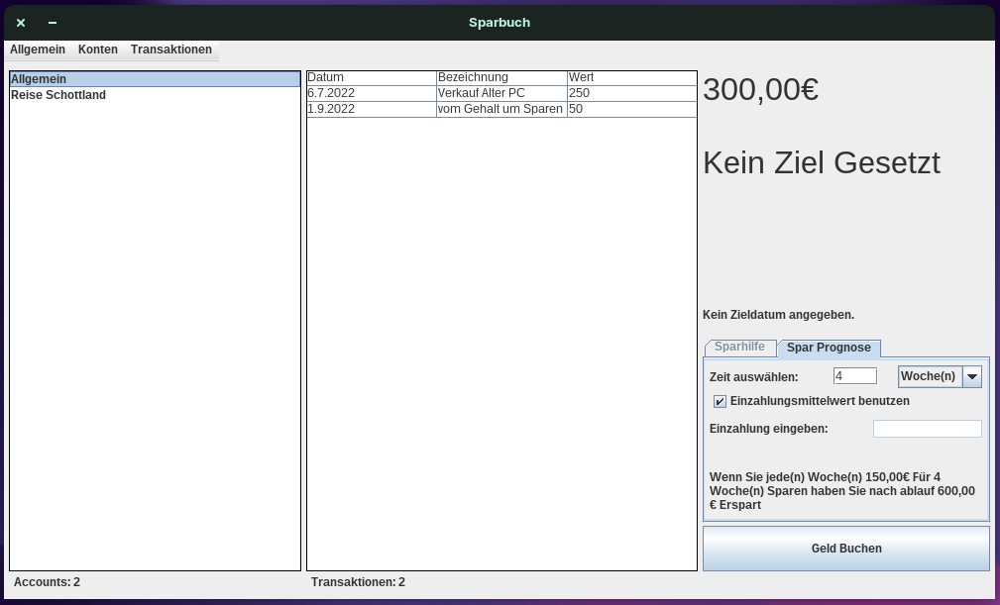
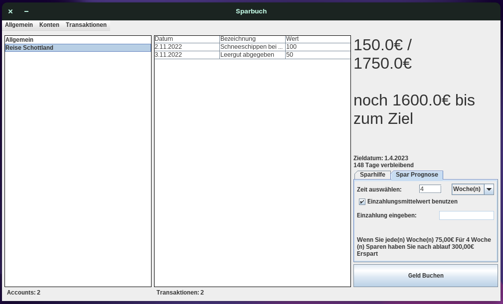

# Sparbuch

Ein kleines Sparbuchprogramm, mit dem der Nutzer immer im Blick hat, wie es um seine Sparziele steht.

*Normales Konto ohne Sparziel*

### Funktionen

- Es können verschiedene Konten angelegt werden, für verschiedene Sparziele.
- Jedes Konto kann eine genaue Summe als Ziel und ein Datum zum Sparen enthalten.
- Konten und Buchungen können bearbeitet oder gelöscht werden.
- Die Gesamtsumme eines Kontos wird berechnet. Falls das Konto ein Sparziel hat, wird dieses zusammen mit der noch nötigen Sparmenge angezeigt. 
- Mit Spar Prognosen kann errechnet werden, wie viel man sich in dem angegebenen Zeitraum erspart hat. Für die Prognosen kann auch der Mittelwert aller bisherigen Transaktionen verwendet werden.
- Die Sparhilfen zeigen, wie viel pro. Zeiteinheit z.B. Wochen gespart werden muss, um das Ziel zu erreichen.

*Konto mit Sparziel. Zeigt wie viel eingezahlt wurde und wie viel noch benötigt wird.*
