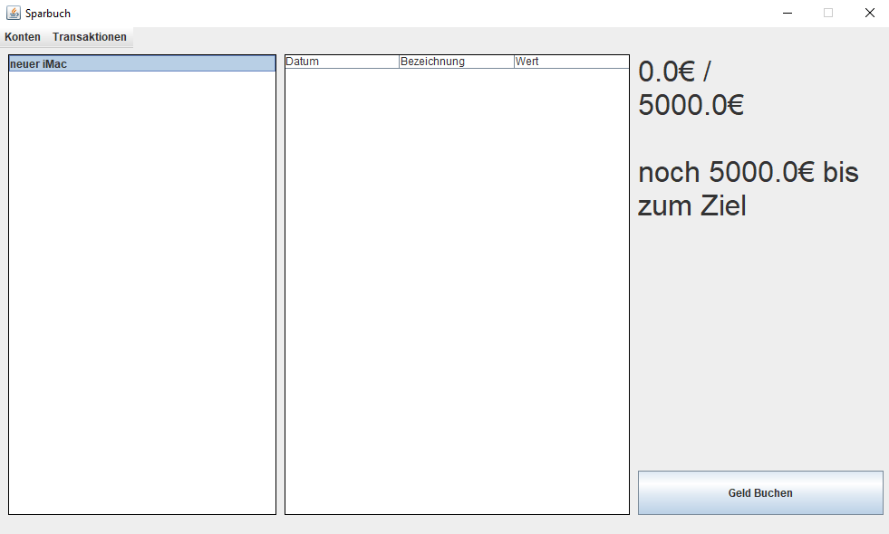

# Sparbuch

Ein kleines Sparbuchprogramm, mit dem der Nutzer immer im Blick hat, wie es um seine Sparziele steht.

### Funktionen

- Es können verschiedene Konten angelegt werden, für verschiedene Sparziele.
- Jedes Konto kann eine genaue Summe als Ziel und ein Datum zum Sparen enthalten.
- Konten und Buchungen können bearbeitet oder gelöscht werden.
- Die Gesamtsumme eines Kontos wird berechnet. Falls das Konto ein Sparziel hat, wird dieses zusammen mit der noch nötigen Sparmenge angezeigt. 
